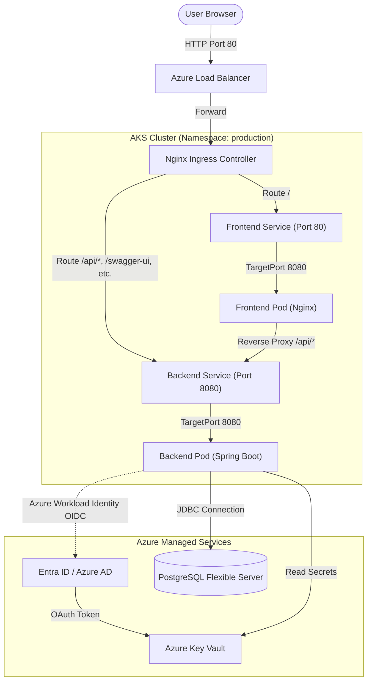
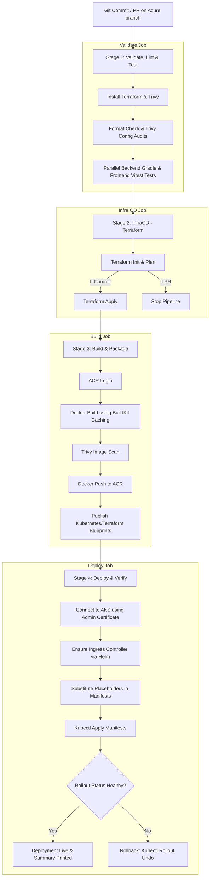

# ATOMIC Tasky — System Architecture & Design Document

This document provides a detailed explanation of the infrastructure, security, networking, and CI/CD architecture of the migrated ATOMIC Tasky application on Microsoft Azure.

---

## 1. High-Level System Architecture

The high-level architecture is designed around containerized microservices running on Azure Kubernetes Service (AKS), a managed PostgreSQL database, and integrated security via Azure Key Vault and Entra ID (OIDC) Workload Identity.

### Component Breakdown
1. **Azure Load Balancer (ALB)**: Automatically provisioned by AKS when the Nginx Ingress Controller service is created. It serves as the public entry point for HTTP requests.
2. **Nginx Ingress Controller**: Manages incoming requests. It routes `/` to the Frontend Service and API endpoints (like `/api/*`, `/swagger-ui`, `/infos`, and `/v3/api-docs`) to the Backend Service.
3. **Frontend Pod (Vue 3 + Nginx)**:
   - Runs as a **non-root user** (`UID 101`) on port `8080` to comply with Kubernetes hardening guidelines.
   - Serves static Vue 3 application assets.
   - Contains an internal Nginx reverse-proxy mapping `/api/`, `/swagger-ui`, `/infos`, etc., to the backend pod, avoiding CORS issues by keeping all interactions under a single origin.
4. **Backend Pod (Spring Boot 3.3)**:
   - Runs as a **non-root user** (`UID 10001`) on port `8080`.
   - Uses the Azure SDK to load properties from Key Vault at startup.
   - Connects to the PostgreSQL Database using credentials resolved dynamically.
5. **Azure Key Vault**: Stores the PostgreSQL database password and other runtime secrets. Securely restricts network access using firewall rules (network ACLs).
6. **PostgreSQL Flexible Server**: A managed database instance residing securely inside a dedicated database subnet.

---

## 2. Low-Level Architecture (CI/CD Pipeline)

The CI/CD pipeline is built using Azure Pipelines. It uses a single concurrent agent slot structure, optimized for speed using stage consolidation, BuildKit cache registries, and local database caching.

### Detailed Pipeline Workflow

#### Stage 1: Validate, Lint & Audit
- Installs Terraform and Trivy.
- Restores Trivy vulnerability DB cache (`$(HOME)/.cache/trivy`) to save download times.
- Audits Terraform and Kubernetes manifests for misconfigurations.
- Restores the Gradle dependencies cache (`$(HOME)/.gradle`) and runs Spring Boot unit tests.
- Restores the npm cache (`$(HOME)/.npm`) and runs Vitest tests.

#### Stage 2: Infrastructure CD (`InfraCD`)
- Consolidated into a single stage to run `terraform apply` once for all resources.
- On PRs: Generates a `terraform plan` and exits to allow review.
- On Direct Commits: Runs `terraform apply` to provision ACR, AKS, Key Vault, and PostgreSQL. It outputs endpoints and client IDs.

#### Stage 3: Build & Package
- Logs into ACR using the service connection.
- Builds backend and frontend Docker containers utilizing Docker BuildKit caching (`--cache-from`) to reuse unchanged layers directly from ACR.
- Scans both built images using Trivy for security vulnerabilities.
- Pushes the images to ACR.
- Collects Kubernetes manifests and Terraform configurations, publishing them as a pipeline artifact (`deployment-assets`).

#### Stage 4: Deploy & Rollback
- Downloads the `deployment-assets` blueprints.
- Connects to the AKS cluster using admin credentials.
- Installs or upgrades the Nginx Ingress Controller using Helm.
- Compiles the Kubernetes manifests using a restricted `envsubst` to replace placeholders (`${ACR_LOGIN_SERVER}`, `${IMAGE_TAG}`, `${KEY_VAULT_URI}`, etc.) without corrupting Nginx's internal variable names (like `$host` and `$remote_addr`).
- Deploys the namespace, configmaps, services, service accounts, and deployments.
- Monitors the rollout status. If the health checks fail or time out, the pipeline executes `kubectl rollout undo` to immediately rollback to the previous stable release.

---

## 3. Security & Networking Architecture

### 3.1 Azure Workload Identity (OIDC)
Instead of storing permanent Azure passwords inside Kubernetes secrets, the Backend pod authenticates via **Azure Workload Identity**:
1. The backend pod is configured with the label `azure.workload.identity/use: "true"`.
2. The AKS mutating admission webhook detects the label and injects an OIDC token volume (`/var/run/secrets/azure/tokens/azure-identity-token`) and environment variables (`AZURE_CLIENT_ID`, `AZURE_TENANT_ID`, `AZURE_FEDERATED_TOKEN_FILE`).
3. The Spring Boot application presents this OIDC token to Microsoft Entra ID.
4. Entra ID validates the token against the **Federated Identity Credential** linked to the User-Assigned Managed Identity (UAMI) (`uami-atomic-tasky-production-backend`).
5. Entra ID issues an OAuth access token, allowing the backend pod to access the Key Vault and retrieve the database password.

### 3.2 Network Partitioning (Subnets & Private Links)
The Virtual Network (`vnet-atomic-tasky-production`) enforces strict boundaries:
- **Public Subnet (`snet-public...`)**: Hosts the external Load Balancer for the Ingress.
- **AKS Subnet (`snet-aks...`)**: Hosts the AKS virtual machines. Access to the Kubernetes API server is restricted to authorized IPs.
- **Database Subnet (`snet-db...`)**: Delegated exclusively to `Microsoft.DBforPostgreSQL/flexibleServers`.
- **Private DNS Zone**: Resolves the database hostname privately within the VNet. Public access to the database is disabled (`enable_public_access = false`).
- **Key Vault Firewall (Network ACLs)**: The Key Vault default action is set to `Deny`. It only accepts traffic originating from the AKS Subnet and the pipeline agents.
